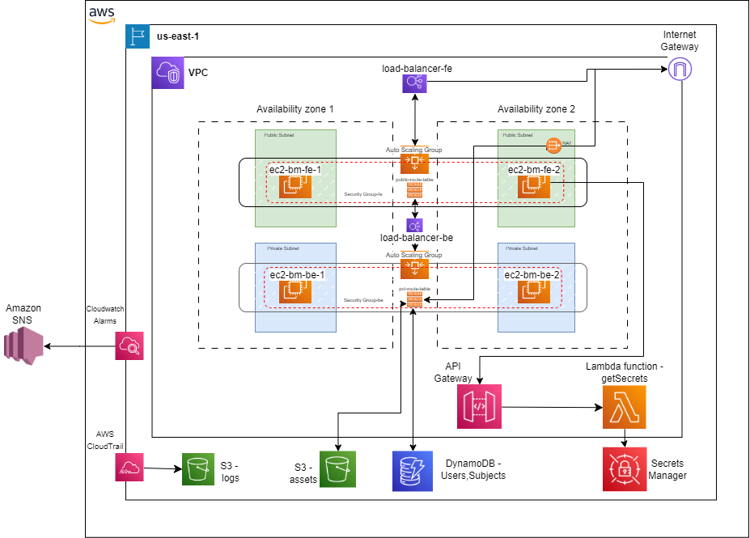

# **Attendance Manager**

## **Overview**

This repository contains the refactored code of my web application, originally based on MongoDB and now migrated to DynamoDB. The application has been fully deployed on AWS, utilizing various services to achieve scalability, performance, and security. The foundation of this project was built using the code from the [ADRE9/bunk-manager-mern](https://github.com/ADRE9/bunk-manager-mern) repository, upon which I made significant changes and additions.


## **Table of Contents**
1. [Description of the Architecture](#description-of-the-architecture)
2. [Implementation Strategy](#implementation-strategy)
   - [Initial Planning and Design](#initial-planning-and-design)
   - [Setting Up the Core Network Infrastructure](#setting-up-the-core-network-infrastructure)
   - [Deployment of Application and Backend Services](#deployment-of-application-and-backend-services)
   - [Database and Storage Integration](#database-and-storage-integration)
   - [Security and Identity Management](#security-and-identity-management)
   - [Monitoring and Optimization](#monitoring-and-optimization)

## **Description of the Architecture**



The architecture of this application is designed to be comprehensive and scalable, leveraging various AWS services to ensure optimal performance, security, and high availability.

### **Key Components:**
- **VPC (Virtual Private Cloud):** Provides an isolated and secure environment for hosting AWS resources.
- **Availability Zones:** Ensures high availability and fault tolerance by distributing infrastructure across multiple zones.
- **Private Application Instances:** Hosted in private subnets for enhanced security.
- **Public and Private Subnets:** Public subnets host internet-facing resources, while private subnets contain application servers.
- **Application Load Balancers (ALB):** Distributes incoming traffic efficiently across multiple EC2 instances.
- **Auto Scaling Groups:** Automatically adjusts the number of EC2 instances based on traffic.
- **Internet Gateway:** Connects the VPC to the internet.
- **NAT Gateway:** Enables outbound internet traffic from private subnets while blocking inbound traffic.
- **API Gateway:** Manages and secures API calls to Lambda functions.
- **Lambda Functions:** Provides serverless computation for executing application logic.
- **IAM Roles:** Ensures secure access and permissions management.
- **DynamoDB:** A fully managed, fast, and scalable NoSQL database.
- **Launch Templates:** Define EC2 instance configurations for consistent scaling.
- **Amazon CloudTrail:** Logs actions in the application, stored securely in S3.
- **CloudWatch Alarms:** Monitors performance metrics and provides real-time alerts.

## **Implementation Strategy**

The development of this AWS-based architecture followed a strategic, phased approach with a focus on efficiency, security, and scalability.

### **Initial Planning and Design**
- Meticulous planning and selection of AWS services based on application requirements.
- Drafted an initial architecture diagram to visualize component interactions.

### **Setting Up the Core Network Infrastructure**
- Established the VPC as the foundation of the network infrastructure.
- Created public and private subnets across different Availability Zones for high availability.
- Configured Internet Gateway and NAT Gateway for traffic management.

### **Deployment of Application and Backend Services**
- Deployed frontend and backend EC2 instances.
- Configured Auto Scaling groups for dynamic scaling.
- Utilized AWS Lambda functions, triggered via API Gateway, for accessing secret keys.

### **Database and Storage Integration**
- Integrated DynamoDB as the primary database for scalability and performance.
- Used Amazon S3 for object storage, including application assets and CloudTrail logs.

### **Security and Identity Management**
- Implemented robust security measures with IAM roles.
- Employed AWS Secrets Manager for handling sensitive credentials.

### **Monitoring and Optimization**
- Set up Amazon CloudWatch alarms for monitoring application performance.
- Regularly reviewed AWS CloudTrail logs and metrics for optimization and issue resolution.


# How To Run the Project

## There are two ways to install the project:

### 1. Conventional Way

**_1._** Open Project Folder</br>

**_2._** To install all dependencies open Command Prompt and run

```
npm i
```

**_3._** To install all client dependencies open client folder and again run

```
npm i
```

**_4._** To run the server-

```
npm run server
```

**_5._** To run the client-

```
npm run client
```

**_6._** To run both server and client- Recommended

```
npm run dev
```

## **Conclusion**

The migration and refactoring of this application, coupled with its deployment on AWS, resulted in a secure, scalable, and efficient platform. The methodical approach ensured the successful execution and ongoing optimization of the architecture. The foundation of this project was made possible by the original codebase from the [ADRE9/bunk-manager-mern](https://github.com/ADRE9/bunk-manager-mern) repository.
